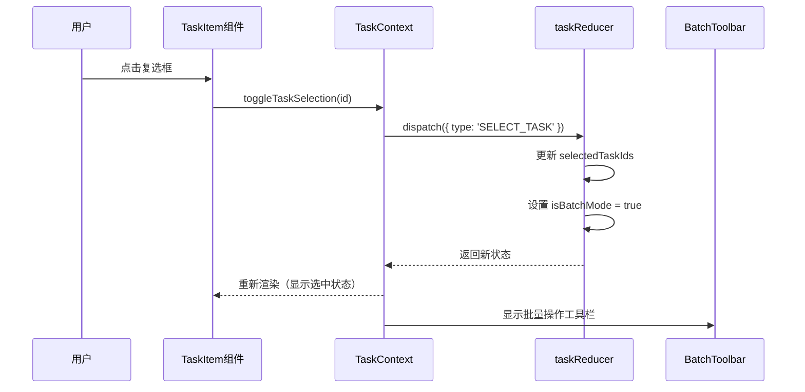
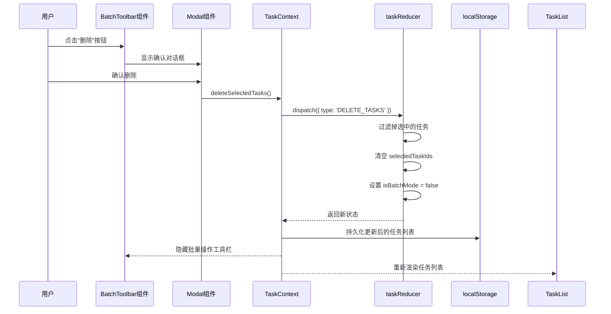
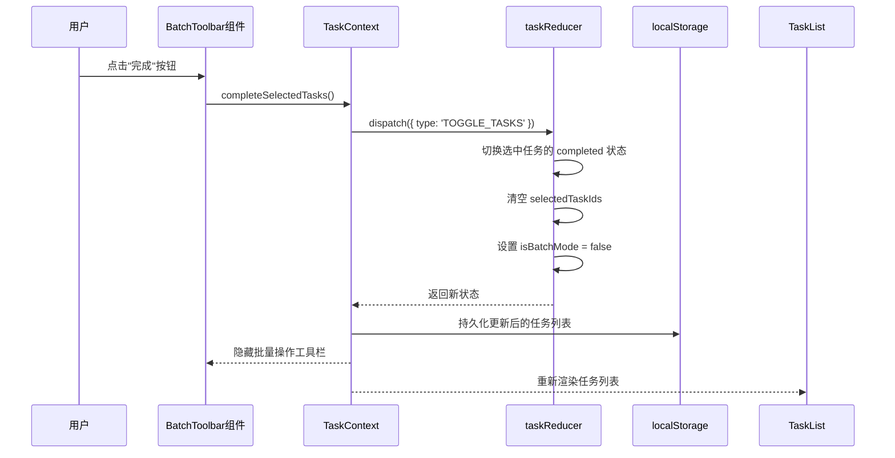
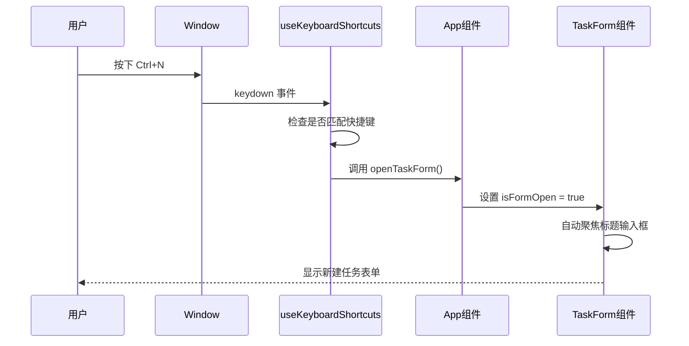
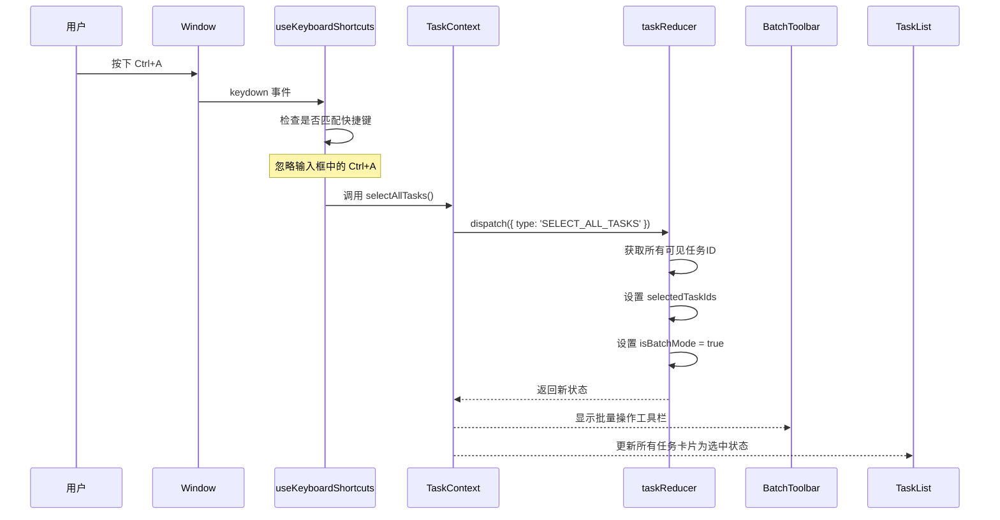
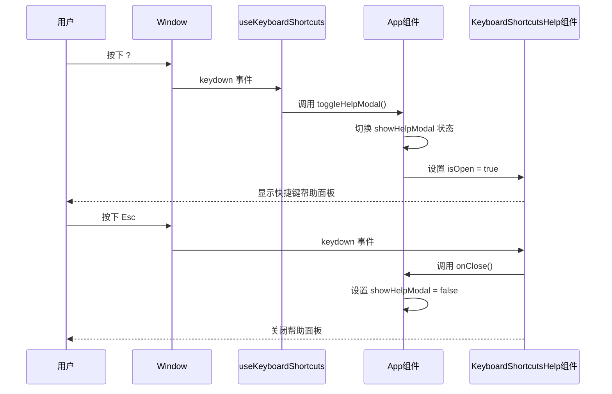

# Todo-List v0.2 批量操作与快捷键功能 架构设计文档

## 文档信息

| 项目     | 内容                |
| -------- | ------------------- |
| 产品名称 | Todo-List           |
| 文档版本 | v0.2-batch-shortcut |
| 创建日期 | 2026-03-09          |
| 设计状态 | 架构设计            |

---

## 一、架构概述

### 1.1 设计目标

基于 PRD-v0.2-batch-shortcut.md 和 UI-Design-v0.2-batch-shortcut.md，为 Todo-List v0.2 设计批量操作和快捷键功能的完整技术架构，确保：

- **可扩展性**：状态管理和组件设计支持未来功能扩展
- **可维护性**：清晰的模块划分和类型定义
- **性能优化**：批量操作的高效渲染和状态更新
- **用户体验**：流畅的动画效果和键盘交互

### 1.2 架构原则

1. **单一职责**：每个组件和 Hook 只负责一个明确的功能
2. **状态集中管理**：所有批量操作状态通过 Context 统一管理
3. **不可变更新**：所有状态更新遵循不可变数据模式
4. **渐进增强**：快捷键功能在不支持键盘的设备上优雅降级

---

## 二、数据模型设计

### 2.1 类型定义扩展

#### 2.1.1 AppState 扩展

```typescript
// src/types/index.ts

/**
 * 应用状态模型 - v0.2 扩展
 */
export interface AppState {
  tasks: Task[]; // 任务列表
  filter: "all" | "completed" | "active"; // 当前筛选
  sortBy: "createdAt" | "completed" | "priority" | "dueDate" | "order"; // 排序方式
  searchTerm: string; // 搜索关键词
  selectedTag: string | null; // 选中的标签
  // ===== v0.2 新增字段 =====
  selectedTaskIds: string[]; // 选中的任务ID列表
  isBatchMode: boolean; // 是否处于批量操作模式
}
```

**溯源**：PRD-v0.2-batch-shortcut.md 5.1 应用状态扩展

#### 2.1.2 TaskAction 扩展

```typescript
// src/types/index.ts

/**
 * 任务操作类型 - v0.2 扩展
 */
export type TaskAction =
  // ... 原有 action 类型
  | { type: "ADD_TASK"; payload: Task }
  | { type: "UPDATE_TASK"; payload: { id: string; updates: Partial<Task> } }
  | { type: "DELETE_TASK"; payload: string }
  | { type: "DELETE_TASKS"; payload: string[] } // 批量删除
  | { type: "TOGGLE_TASK"; payload: string }
  | { type: "TOGGLE_TASKS"; payload: string[] } // 批量切换完成状态
  | { type: "SET_FILTER"; payload: "all" | "completed" | "active" }
  | {
      type: "SET_SORT_BY";
      payload: "createdAt" | "completed" | "priority" | "dueDate" | "order";
    }
  | { type: "SET_SEARCH_TERM"; payload: string }
  | { type: "SET_SELECTED_TAG"; payload: string | null }
  | {
      type: "REORDER_TASKS";
      payload: { sourceIndex: number; destinationIndex: number };
    }
  // ===== v0.2 新增 action 类型 =====
  | { type: "SELECT_TASK"; payload: string } // 选中单个任务
  | { type: "DESELECT_TASK"; payload: string } // 取消选中单个任务
  | { type: "SELECT_ALL_TASKS" } // 全选所有可见任务
  | { type: "DESELECT_ALL_TASKS" } // 取消全选
  | { type: "SET_BATCH_MODE"; payload: boolean }; // 设置批量模式状态
```

**溯源**：PRD-v0.2-batch-shortcut.md 5.2 操作类型扩展

### 2.2 初始状态更新

```typescript
// src/context/TaskContext.tsx

const initialState: AppState = {
  tasks: loadFromLocalStorage(),
  filter: "all",
  sortBy: "createdAt",
  searchTerm: "",
  selectedTag: null,
  // ===== v0.2 新增初始值 =====
  selectedTaskIds: [],
  isBatchMode: false,
};
```

---

## 三、状态管理架构

### 3.1 Reducer 扩展设计

```typescript
// src/context/TaskContext.tsx - Reducer 扩展

const taskReducer = (state: AppState, action: TaskAction): AppState => {
  switch (action.type) {
    // ... 原有 case

    // ===== v0.2 新增批量操作 case =====

    case "DELETE_TASKS":
      return {
        ...state,
        tasks: state.tasks.filter((task) => !action.payload.includes(task.id)),
        selectedTaskIds: [], // 清空选中
        isBatchMode: false, // 退出批量模式
      };

    case "TOGGLE_TASKS":
      return {
        ...state,
        tasks: state.tasks.map((task) =>
          action.payload.includes(task.id)
            ? { ...task, completed: !task.completed, updatedAt: Date.now() }
            : task
        ),
        selectedTaskIds: [], // 清空选中
        isBatchMode: false, // 退出批量模式
      };

    case "SELECT_TASK":
      return {
        ...state,
        selectedTaskIds: [...state.selectedTaskIds, action.payload],
        isBatchMode: true,
      };

    case "DESELECT_TASK":
      const newSelectedIds = state.selectedTaskIds.filter(
        (id) => id !== action.payload
      );
      return {
        ...state,
        selectedTaskIds: newSelectedIds,
        isBatchMode: newSelectedIds.length > 0,
      };

    case "SELECT_ALL_TASKS": {
      // 获取当前可见的任务ID（考虑筛选和搜索）
      const visibleTaskIds = getVisibleTaskIds(state);
      return {
        ...state,
        selectedTaskIds: visibleTaskIds,
        isBatchMode: true,
      };
    }

    case "DESELECT_ALL_TASKS":
      return {
        ...state,
        selectedTaskIds: [],
        isBatchMode: false,
      };

    case "SET_BATCH_MODE":
      return {
        ...state,
        isBatchMode: action.payload,
        // 退出批量模式时清空选中
        selectedTaskIds: action.payload ? state.selectedTaskIds : [],
      };

    default:
      return state;
  }
};

// 辅助函数：获取当前可见的任务ID
const getVisibleTaskIds = (state: AppState): string[] => {
  const { tasks, filter, searchTerm, selectedTag } = state;
  return tasks
    .filter((task) => {
      const matchesFilter =
        filter === "all"
          ? true
          : filter === "completed"
          ? task.completed
          : !task.completed;
      const matchesSearch =
        searchTerm === "" ||
        task.title.toLowerCase().includes(searchTerm.toLowerCase()) ||
        task.description.toLowerCase().includes(searchTerm.toLowerCase());
      const matchesTag = !selectedTag || task.tags.includes(selectedTag);
      return matchesFilter && matchesSearch && matchesTag;
    })
    .map((task) => task.id);
};
```

### 3.2 Context Provider 扩展

```typescript
// src/context/TaskContext.tsx - Context 类型扩展

interface TaskContextType {
  // ... 原有属性
  state: AppState;
  dispatch: React.Dispatch<TaskAction>;

  // ===== v0.2 新增批量操作方法 =====
  selectedCount: number; // 选中任务数量
  selectTask: (id: string) => void;
  deselectTask: (id: string) => void;
  selectAllTasks: () => void;
  deselectAllTasks: () => void;
  deleteSelectedTasks: () => void;
  toggleSelectedTasks: () => void;
  isTaskSelected: (id: string) => boolean;
}
```

---

## 四、组件架构设计

### 4.1 组件关系图

```
┌─────────────────────────────────────────────────────────────────┐
│                           App.tsx                               │
│  ┌─────────────────────────────────────────────────────────┐   │
│  │                    useKeyboardShortcuts                 │   │
│  │              (全局快捷键监听和处理)                      │   │
│  └─────────────────────────────────────────────────────────┘   │
│                          │                                      │
│                          ▼                                      │
│  ┌─────────────────────────────────────────────────────────┐   │
│  │                   TaskContext.Provider                  │   │
│  │              (批量操作状态管理)                          │   │
│  └─────────────────────────────────────────────────────────┘   │
│                          │                                      │
│          ┌───────────────┼───────────────┐                     │
│          ▼               ▼               ▼                     │
│  ┌──────────────┐ ┌──────────────┐ ┌──────────────┐           │
│  │   Header     │ │   Toolbar    │ │  TaskList    │           │
│  │  (搜索框)     │ │ (筛选/排序)   │ │  (任务列表)   │           │
│  └──────────────┘ └──────────────┘ └──────────────┘           │
│                                           │                    │
│                              ┌────────────┴────────────┐       │
│                              ▼                         ▼       │
│                    ┌──────────────────┐     ┌──────────────┐  │
│                    │  BatchToolbar    │     │  TaskItem[]  │  │
│                    │ (批量操作工具栏)  │     │  (任务卡片)   │  │
│                    └──────────────────┘     └──────────────┘  │
│                                                          │     │
│                                               ┌─────────┘     │
│                                               ▼               │
│                                    ┌──────────────────┐      │
│                                    │ SelectionCheckbox│      │
│                                    │  (选择复选框)     │      │
│                                    └──────────────────┘      │
└─────────────────────────────────────────────────────────────────┘

┌─────────────────────────────────────────────────────────────────┐
│                     模态框组件 (条件渲染)                         │
│  ┌──────────────────┐  ┌──────────────────────────────────────┐ │
│  │  BatchDeleteModal│  │    KeyboardShortcutsHelp             │ │
│  │ (批量删除确认)    │  │      (快捷键帮助面板)                 │ │
│  └──────────────────┘  └──────────────────────────────────────┘ │
└─────────────────────────────────────────────────────────────────┘
```

### 4.2 新增组件设计

#### 4.2.1 BatchToolbar 组件

```typescript
// src/components/BatchToolbar.tsx

interface BatchToolbarProps {
  selectedCount: number; // 选中任务数量
  totalCount: number; // 可见任务总数
  onSelectAll: () => void; // 全选回调
  onDeselectAll: () => void; // 取消全选回调
  onBatchComplete: () => void; // 批量完成回调
  onBatchDelete: () => void; // 批量删除回调
}

/**
 * 批量操作工具栏组件
 *
 * 功能：
 * - 显示当前选中任务数量
 * - 提供全选/取消全选按钮
 * - 提供批量完成按钮
 * - 提供批量删除按钮（危险操作）
 *
 * 样式：
 * - 位置：筛选栏下方，条件渲染（仅当有选中任务时显示）
 * - 背景：浅灰色 (#F3F4F6)
 * - 高度：56px
 * - 动画：滑入/滑出效果
 *
 * 溯源：UI-Design-v0.2-batch-shortcut.md 2.2 批量操作工具栏
 */
```

#### 4.2.2 SelectionCheckbox 组件

```typescript
// src/components/SelectionCheckbox.tsx

interface SelectionCheckboxProps {
  isSelected: boolean; // 是否选中
  onSelect: () => void; // 选择回调
  onDeselect: () => void; // 取消选择回调
  label: string; // ARIA 标签（任务标题）
}

/**
 * 任务选择复选框组件
 *
 * 功能：
 * - 显示选中/未选中状态
 * - 支持点击切换
 * - 支持键盘操作（Space/Enter）
 * - 提供无障碍支持
 *
 * 样式：
 * - 尺寸：20px × 20px
 * - 位置：任务卡片左侧
 * - 状态：未选中/悬停/选中/聚焦
 * - 动画：选中时的弹跳效果
 *
 * 溯源：UI-Design-v0.2-batch-shortcut.md 2.1 任务卡片复选框设计
 */
```

#### 4.2.3 KeyboardShortcutsHelp 组件

```typescript
// src/components/KeyboardShortcutsHelp.tsx

interface KeyboardShortcutsHelpProps {
  isOpen: boolean; // 是否显示
  onClose: () => void; // 关闭回调
}

interface ShortcutGroup {
  title: string;
  shortcuts: {
    keys: string[];
    description: string;
  }[];
}

/**
 * 快捷键帮助面板组件
 *
 * 功能：
 * - 显示所有可用的键盘快捷键
 * - 按功能分组展示
 * - 支持键盘关闭（Esc）
 *
 * 样式：
 * - 宽度：400px
 * - 圆角：12px
 * - 阴影：大阴影突出显示
 * - 动画：淡入 + 缩放效果
 *
 * 快捷键分组：
 * 1. 任务操作（新建、保存、取消、删除、标记完成）
 * 2. 导航与选择（聚焦搜索、全选）
 * 3. 帮助（显示/隐藏快捷键面板）
 *
 * 溯源：UI-Design-v0.2-batch-shortcut.md 3. 快捷键帮助面板 UI 设计
 */
```

### 4.3 现有组件更新

#### 4.3.1 TaskItem 组件更新

```typescript
// src/components/TaskItem.tsx - Props 扩展

interface TaskItemProps {
  task: Task;
  onToggle: (id: string) => void;
  onEdit: (task: Task) => void;
  onDelete: (id: string) => void;
  index: number;
  moveTask: (dragIndex: number, hoverIndex: number) => void;
  // ===== v0.2 新增 Props =====
  isSelected: boolean; // 是否被选中
  onSelect: (id: string) => void; // 选择回调
  selectionMode: boolean; // 是否处于批量选择模式
}

/**
 * 更新内容：
 * 1. 添加选择复选框到卡片左侧
 * 2. 选中状态显示高亮边框和背景
 * 3. 复选框点击事件不触发卡片其他操作
 * 4. 支持键盘导航和屏幕阅读器
 *
 * 样式更新：
 * - 选中状态边框：2px solid #3B82F6
 * - 选中状态背景：#EFF6FF
 * - 选中状态阴影：外发光效果
 *
 * 溯源：UI-Design-v0.2-batch-shortcut.md 2.3 任务卡片选中状态
 */
```

#### 4.3.2 TaskList 组件更新

```typescript
// src/components/TaskList.tsx - 集成批量操作

interface TaskListProps {
  // ... 原有 props
}

/**
 * 更新内容：
 * 1. 集成 BatchToolbar 组件（条件渲染）
 * 2. 向 TaskItem 传递选中状态和回调
 * 3. 管理批量删除确认弹窗
 *
 * 布局更新：
 * ┌─────────────────────────────────────┐
 * │ Toolbar (筛选/排序)                  │
 * ├─────────────────────────────────────┤
 * │ BatchToolbar (条件渲染)              │  ← v0.2 新增
 * ├─────────────────────────────────────┤
 * │ TaskItem[]                          │
 * └─────────────────────────────────────┘
 */
```

---

## 五、自定义 Hooks 设计

### 5.1 useKeyboardShortcuts Hook

````typescript
// src/hooks/useKeyboardShortcuts.ts

import { useEffect, useCallback } from "react";

interface ShortcutConfig {
  key: string; // 按键（如 'n', 'f', 'Escape'）
  ctrl?: boolean; // 是否需要 Ctrl/Cmd
  shift?: boolean; // 是否需要 Shift
  alt?: boolean; // 是否需要 Alt
  handler: () => void; // 处理函数
  description: string; // 快捷键描述（用于帮助面板）
  group: string; // 分组（用于帮助面板分类）
}

interface UseKeyboardShortcutsOptions {
  shortcuts: ShortcutConfig[];
  enabled?: boolean; // 是否启用（默认 true）
  ignoreInputs?: boolean; // 是否在输入框中忽略（默认 true）
}

/**
 * 键盘快捷键 Hook
 *
 * 功能：
 * - 监听全局键盘事件
 * - 支持组合键（Ctrl/Cmd + key）
 * - 智能忽略输入框中的按键
 * - 防止与浏览器默认快捷键冲突
 *
 * 使用示例：
 * ```tsx
 * useKeyboardShortcuts({
 *   shortcuts: [
 *     { key: 'n', ctrl: true, handler: openTaskForm, description: '新建任务', group: '任务操作' },
 *     { key: 'f', ctrl: true, handler: focusSearch, description: '聚焦搜索', group: '导航与选择' },
 *     { key: 'a', ctrl: true, handler: selectAll, description: '全选任务', group: '导航与选择' },
 *     { key: 'Delete', handler: deleteSelected, description: '删除选中', group: '任务操作' },
 *     { key: ' ', handler: toggleSelected, description: '标记完成', group: '任务操作' },
 *     { key: '?', handler: showHelp, description: '显示帮助', group: '帮助' },
 *     { key: 'Escape', handler: handleEscape, description: '取消操作', group: '任务操作' },
 *   ],
 * });
 * ```
 *
 * 溯源：PRD-v0.2-batch-shortcut.md 6.2 快捷键实现
 */

export const useKeyboardShortcuts = (options: UseKeyboardShortcutsOptions) => {
  const { shortcuts, enabled = true, ignoreInputs = true } = options;

  const handleKeyDown = useCallback(
    (event: KeyboardEvent) => {
      if (!enabled) return;

      // 忽略输入框中的快捷键
      if (ignoreInputs) {
        const target = event.target as HTMLElement;
        if (
          target instanceof HTMLInputElement ||
          target instanceof HTMLTextAreaElement ||
          target.isContentEditable
        ) {
          // 允许 Escape 在输入框中工作
          if (event.key !== "Escape") return;
        }
      }

      // 匹配快捷键
      for (const shortcut of shortcuts) {
        const isCtrl = shortcut.ctrl ? event.ctrlKey || event.metaKey : true;
        const isShift = shortcut.shift ? event.shiftKey : true;
        const isAlt = shortcut.alt ? event.altKey : true;
        const isKey = event.key.toLowerCase() === shortcut.key.toLowerCase();

        if (isCtrl && isShift && isAlt && isKey) {
          event.preventDefault();
          shortcut.handler();
          break;
        }
      }
    },
    [shortcuts, enabled, ignoreInputs]
  );

  useEffect(() => {
    window.addEventListener("keydown", handleKeyDown);
    return () => window.removeEventListener("keydown", handleKeyDown);
  }, [handleKeyDown]);

  // 返回快捷键列表（用于帮助面板）
  return {
    shortcuts: shortcuts.map((s) => ({
      keys: [
        ...(s.ctrl ? ["Ctrl"] : []),
        ...(s.shift ? ["Shift"] : []),
        ...(s.alt ? ["Alt"] : []),
        s.key === " " ? "Space" : s.key,
      ],
      description: s.description,
      group: s.group,
    })),
  };
};
````

### 5.2 useBatchOperations Hook（可选）

```typescript
// src/hooks/useBatchOperations.ts

import { useCallback } from "react";
import { useTasks } from "./useTasks";

interface UseBatchOperationsReturn {
  selectedCount: number;
  isBatchMode: boolean;
  selectTask: (id: string) => void;
  deselectTask: (id: string) => void;
  toggleTaskSelection: (id: string) => void;
  selectAll: () => void;
  deselectAll: () => void;
  deleteSelected: () => void;
  completeSelected: () => void;
  isSelected: (id: string) => boolean;
}

/**
 * 批量操作逻辑 Hook
 *
 * 功能：
 * - 封装批量操作的所有业务逻辑
 * - 提供简洁的 API 给组件使用
 * - 自动处理状态流转
 *
 * 使用场景：
 * - 当多个组件需要批量操作功能时，避免重复逻辑
 *
 * 溯源：PRD-v0.2-batch-shortcut.md 6.1 批量操作实现
 */

export const useBatchOperations = (): UseBatchOperationsReturn => {
  const { state, dispatch } = useTasks();

  const selectTask = useCallback(
    (id: string) => {
      dispatch({ type: "SELECT_TASK", payload: id });
    },
    [dispatch]
  );

  const deselectTask = useCallback(
    (id: string) => {
      dispatch({ type: "DESELECT_TASK", payload: id });
    },
    [dispatch]
  );

  const toggleTaskSelection = useCallback(
    (id: string) => {
      if (state.selectedTaskIds.includes(id)) {
        dispatch({ type: "DESELECT_TASK", payload: id });
      } else {
        dispatch({ type: "SELECT_TASK", payload: id });
      }
    },
    [dispatch, state.selectedTaskIds]
  );

  const selectAll = useCallback(() => {
    dispatch({ type: "SELECT_ALL_TASKS" });
  }, [dispatch]);

  const deselectAll = useCallback(() => {
    dispatch({ type: "DESELECT_ALL_TASKS" });
  }, [dispatch]);

  const deleteSelected = useCallback(() => {
    dispatch({ type: "DELETE_TASKS", payload: state.selectedTaskIds });
  }, [dispatch, state.selectedTaskIds]);

  const completeSelected = useCallback(() => {
    dispatch({ type: "TOGGLE_TASKS", payload: state.selectedTaskIds });
  }, [dispatch, state.selectedTaskIds]);

  const isSelected = useCallback(
    (id: string) => {
      return state.selectedTaskIds.includes(id);
    },
    [state.selectedTaskIds]
  );

  return {
    selectedCount: state.selectedTaskIds.length,
    isBatchMode: state.isBatchMode,
    selectTask,
    deselectTask,
    toggleTaskSelection,
    selectAll,
    deselectAll,
    deleteSelected,
    completeSelected,
    isSelected,
  };
};
```

---

## 六、状态流转与调用链

### 6.1 批量操作流程

#### 6.1.1 选择任务流程



#### 6.1.2 批量删除流程



#### 6.1.3 批量标记完成流程



### 6.2 快捷键操作流程

#### 6.2.1 新建任务快捷键 (Ctrl+N)



#### 6.2.2 全选快捷键 (Ctrl+A)



#### 6.2.3 快捷键帮助面板 (?)



---

## 七、样式架构设计

### 7.1 CSS 变量扩展

```css
/* src/styles/design-tokens.css - v0.2 新增变量 */

:root {
  /* ... 原有变量 */

  /* ===== 批量操作 ===== */
  --batch-toolbar-height: 56px;
  --batch-toolbar-bg: #f3f4f6;
  --batch-toolbar-border: var(--color-border-primary);

  --batch-checkbox-size: 20px;
  --batch-checkbox-border-width: 2px;
  --batch-checkbox-border-color: #e5e7eb;
  --batch-checkbox-hover-border: var(--color-primary);
  --batch-checkbox-checked-bg: var(--color-primary);
  --batch-checkbox-checked-border: var(--color-primary);
  --batch-checkbox-check-color: var(--color-bg-primary);

  --batch-card-selected-bg: #eff6ff;
  --batch-card-selected-border: var(--color-primary);
  --batch-card-selected-shadow: 0 0 0 3px rgba(59, 130, 246, 0.1);

  /* ===== 快捷键面板 ===== */
  --shortcuts-modal-width: 400px;
  --shortcuts-modal-max-height: 80vh;
  --shortcuts-modal-radius: 12px;

  --shortcuts-key-bg: linear-gradient(180deg, #ffffff 0%, #f3f4f6 100%);
  --shortcuts-key-border: #d1d5db;
  --shortcuts-key-color: #374151;
  --shortcuts-key-shadow: 0 1px 2px rgba(0, 0, 0, 0.05), 0 1px 0 #ffffff inset;

  --shortcuts-group-title-color: #6b7280;
  --shortcuts-group-title-size: 12px;

  /* ===== 动画时间 ===== */
  --batch-toolbar-transition: 0.2s ease-out;
  --batch-checkbox-transition: 0.15s ease-in-out;
  --batch-card-transition: 0.2s ease-out;
}

/* 响应式断点 */
@media (max-width: 640px) {
  :root {
    --batch-toolbar-height: auto;
    --shortcuts-modal-width: 100%;
  }
}
```

**溯源**：UI-Design-v0.2-batch-shortcut.md 7.1 新增 CSS 变量

### 7.2 关键动画设计

#### 7.2.1 批量操作工具栏动画

```css
/* src/styles/components.css - 批量操作工具栏动画 */

/* 进入动画 */
@keyframes batchToolbarSlideIn {
  from {
    opacity: 0;
    transform: translateY(-10px);
    max-height: 0;
  }
  to {
    opacity: 1;
    transform: translateY(0);
    max-height: var(--batch-toolbar-height);
  }
}

/* 退出动画 */
@keyframes batchToolbarSlideOut {
  from {
    opacity: 1;
    transform: translateY(0);
    max-height: var(--batch-toolbar-height);
  }
  to {
    opacity: 0;
    transform: translateY(-10px);
    max-height: 0;
  }
}

.batch-toolbar {
  animation: batchToolbarSlideIn var(--batch-toolbar-transition);
}

.batch-toolbar--exit {
  animation: batchToolbarSlideOut var(--batch-toolbar-transition);
}

/* 选中计数脉冲动画 */
@keyframes countPulse {
  0%,
  100% {
    transform: scale(1);
  }
  50% {
    transform: scale(1.1);
  }
}

.batch-toolbar__count--changed {
  animation: countPulse 0.2s ease-out;
}
```

**溯源**：UI-Design-v0.2-batch-shortcut.md 5.3 工具栏过渡

#### 7.2.2 复选框动画

```css
/* src/styles/components.css - 复选框动画 */

/* 选中时的弹跳动画 */
@keyframes checkboxBounce {
  0% {
    transform: scale(1);
  }
  50% {
    transform: scale(1.2);
  }
  100% {
    transform: scale(1);
  }
}

/* 对勾绘制动画 */
@keyframes checkDraw {
  from {
    stroke-dashoffset: 20;
  }
  to {
    stroke-dashoffset: 0;
  }
}

.task-card__checkbox {
  transition: all var(--batch-checkbox-transition);
}

.task-card__checkbox--checked {
  animation: checkboxBounce 0.3s ease-out;
}

.task-card__checkbox-icon {
  stroke-dasharray: 20;
  stroke-dashoffset: 20;
}

.task-card__checkbox--checked .task-card__checkbox-icon {
  animation: checkDraw 0.2s ease-out forwards;
}
```

**溯源**：UI-Design-v0.2-batch-shortcut.md 5.1 复选框动画

#### 7.2.3 任务卡片选中状态动画

```css
/* src/styles/components.css - 任务卡片选中状态 */

.task-card {
  transition: border-color var(--batch-card-transition), background-color var(--batch-card-transition),
    box-shadow var(--batch-card-transition);
}

.task-card--selected {
  border-color: var(--batch-card-selected-border);
  border-width: 2px;
  background-color: var(--batch-card-selected-bg);
  box-shadow: var(--batch-card-selected-shadow);
}
```

**溯源**：UI-Design-v0.2-batch-shortcut.md 5.2 卡片选中动画

#### 7.2.4 快捷键面板动画

```css
/* src/styles/components.css - 快捷键面板动画 */

@keyframes modalFadeIn {
  from {
    opacity: 0;
    transform: scale(0.95);
  }
  to {
    opacity: 1;
    transform: scale(1);
  }
}

@keyframes modalFadeOut {
  from {
    opacity: 1;
    transform: scale(1);
  }
  to {
    opacity: 0;
    transform: scale(0.95);
  }
}

.keyboard-shortcuts-modal {
  animation: modalFadeIn 0.2s ease-out;
}

.keyboard-shortcuts-modal--exit {
  animation: modalFadeOut 0.2s ease-out;
}
```

**溯源**：UI-Design-v0.2-batch-shortcut.md 5.4 快捷键面板动画

---

## 八、目录结构更新

```
todo-solo/
├── src/
│   ├── components/              # 组件
│   │   ├── Header.tsx
│   │   ├── SearchBar.tsx
│   │   ├── Toolbar.tsx
│   │   ├── TaskList.tsx
│   │   ├── TaskItem.tsx         # 更新：添加选择复选框
│   │   ├── TaskForm.tsx
│   │   ├── Footer.tsx
│   │   ├── Modal.tsx
│   │   ├── EmptyState.tsx
│   │   ├── BatchToolbar.tsx     # 新增：批量操作工具栏
│   │   ├── SelectionCheckbox.tsx # 新增：选择复选框组件
│   │   └── KeyboardShortcutsHelp.tsx # 新增：快捷键帮助面板
│   ├── hooks/                   # 自定义 Hooks
│   │   ├── useTasks.ts
│   │   ├── useLocalStorage.ts
│   │   ├── useKeyboardShortcuts.ts # 新增：键盘快捷键 Hook
│   │   └── useBatchOperations.ts   # 新增：批量操作 Hook（可选）
│   ├── context/
│   │   └── TaskContext.tsx      # 更新：添加批量操作状态和方法
│   ├── types/
│   │   └── index.ts             # 更新：扩展类型定义
│   ├── utils/
│   │   ├── storage.ts
│   │   └── helpers.ts
│   ├── styles/
│   │   ├── global.css
│   │   ├── design-tokens.css    # 更新：添加批量操作和快捷键变量
│   │   └── components.css       # 更新：添加新组件样式
│   ├── App.tsx                  # 更新：集成快捷键监听
│   └── main.tsx
├── docs/
│   ├── PRD-v0.2-batch-shortcut.md
│   └── acceptance/
│       └── v0.2-acceptance.md
├── design/
│   └── UI-Design-v0.2-batch-shortcut.md
└── agent_work/
    └── frontend-architecture-v0.2-batch-shortcut.md  # 本文档
```

---

## 九、关键类与函数汇总

### 9.1 新增/更新的类与函数

| 类/函数名               | 说明                      | 参数                          | 返回                       | 所属文件                               | 溯源          |
| ----------------------- | ------------------------- | ----------------------------- | -------------------------- | -------------------------------------- | ------------- |
| `BatchToolbar`          | 批量操作工具栏组件        | `BatchToolbarProps`           | `JSX.Element`              | `components/BatchToolbar.tsx`          | UI-Design 2.2 |
| `SelectionCheckbox`     | 任务选择复选框            | `SelectionCheckboxProps`      | `JSX.Element`              | `components/SelectionCheckbox.tsx`     | UI-Design 2.1 |
| `KeyboardShortcutsHelp` | 快捷键帮助面板            | `KeyboardShortcutsHelpProps`  | `JSX.Element`              | `components/KeyboardShortcutsHelp.tsx` | UI-Design 3   |
| `useKeyboardShortcuts`  | 键盘快捷键 Hook           | `UseKeyboardShortcutsOptions` | `{ shortcuts }`            | `hooks/useKeyboardShortcuts.ts`        | PRD 6.2       |
| `useBatchOperations`    | 批量操作逻辑 Hook（可选） | -                             | `UseBatchOperationsReturn` | `hooks/useBatchOperations.ts`          | PRD 6.1       |
| `taskReducer`           | Reducer 扩展              | `AppState, TaskAction`        | `AppState`                 | `context/TaskContext.tsx`              | PRD 5.2       |
| `getVisibleTaskIds`     | 获取可见任务 ID           | `AppState`                    | `string[]`                 | `context/TaskContext.tsx`              | PRD 6.1       |

### 9.2 扩展的 Action 类型

| Action Type          | Payload    | 说明             | 溯源    |
| -------------------- | ---------- | ---------------- | ------- |
| `DELETE_TASKS`       | `string[]` | 批量删除任务     | PRD 5.2 |
| `TOGGLE_TASKS`       | `string[]` | 批量切换完成状态 | PRD 5.2 |
| `SELECT_TASK`        | `string`   | 选中单个任务     | PRD 5.2 |
| `DESELECT_TASK`      | `string`   | 取消选中单个任务 | PRD 5.2 |
| `SELECT_ALL_TASKS`   | -          | 全选所有可见任务 | PRD 5.2 |
| `DESELECT_ALL_TASKS` | -          | 取消全选         | PRD 5.2 |
| `SET_BATCH_MODE`     | `boolean`  | 设置批量模式状态 | PRD 5.2 |

### 9.3 扩展的 State 字段

| 字段名            | 类型       | 初始值  | 说明                 | 溯源    |
| ----------------- | ---------- | ------- | -------------------- | ------- |
| `selectedTaskIds` | `string[]` | `[]`    | 选中的任务 ID 列表   | PRD 5.1 |
| `isBatchMode`     | `boolean`  | `false` | 是否处于批量操作模式 | PRD 5.1 |

---

## 十、快捷键映射表

| 快捷键             | 功能                | 处理函数            | 分组       | 溯源            |
| ------------------ | ------------------- | ------------------- | ---------- | --------------- |
| `Ctrl+N` / `Cmd+N` | 新建任务            | `openTaskForm()`    | 任务操作   | PRD 2.2 F-013-1 |
| `Enter`            | 确认保存            | `submitTaskForm()`  | 任务操作   | PRD 2.2 F-013-2 |
| `Esc`              | 取消操作            | `handleEscape()`    | 任务操作   | PRD 2.2 F-013-3 |
| `Ctrl+F` / `Cmd+F` | 聚焦搜索框          | `focusSearch()`     | 导航与选择 | PRD 2.2 F-013-4 |
| `Ctrl+A` / `Cmd+A` | 全选任务            | `selectAllTasks()`  | 导航与选择 | PRD 2.2 F-013-5 |
| `Delete`           | 删除选中任务        | `deleteSelected()`  | 任务操作   | PRD 2.2 F-013-6 |
| `Space`            | 标记完成/未完成     | `toggleSelected()`  | 任务操作   | PRD 2.2 F-013-7 |
| `?` / `Shift+?`    | 显示/隐藏快捷键帮助 | `toggleHelpModal()` | 帮助       | PRD 2.2 F-013-8 |

---

## 十一、验收标准映射

### 11.1 批量操作验收

| 验收项                              | 实现方式                                                        | 测试要点                    |
| ----------------------------------- | --------------------------------------------------------------- | --------------------------- |
| 点击任务复选框可以选中/取消选中任务 | `SelectionCheckbox` 组件 + `SELECT_TASK`/`DESELECT_TASK` action | 点击事件、状态更新、UI 反馈 |
| 选中任务后显示批量操作工具栏        | `BatchToolbar` 条件渲染（`isBatchMode`）                        | 条件渲染、动画效果          |
| 工具栏显示正确的选中数量            | `selectedCount` 计算属性                                        | 计数准确性、数字变化动画    |
| 点击"全选"选中所有可见任务          | `SELECT_ALL_TASKS` action + `getVisibleTaskIds`                 | 筛选状态下的全选            |
| 点击"取消全选"取消所有选择          | `DESELECT_ALL_TASKS` action                                     | 状态清空、工具栏隐藏        |
| 点击"完成"批量标记选中任务为已完成  | `TOGGLE_TASKS` action                                           | 批量状态切换、退出批量模式  |
| 点击"删除"弹出确认对话框            | `Modal` 组件复用                                                | 确认对话框内容适配          |
| 确认后批量删除选中任务              | `DELETE_TASKS` action                                           | 批量删除、状态清理          |
| 批量操作后显示成功提示              | Toast/Notification（如需要）                                    | 提示内容和时机              |
| 批量操作后自动退出批量模式          | Reducer 中设置 `isBatchMode = false`                            | 自动清理机制                |

### 11.2 快捷键验收

| 验收项                         | 实现方式                              | 测试要点               |
| ------------------------------ | ------------------------------------- | ---------------------- |
| `Ctrl+N` 打开新建任务表单      | `useKeyboardShortcuts` Hook           | 快捷键监听、表单打开   |
| `Enter` 在表单中确认保存       | 表单 onSubmit 处理                    | 输入框聚焦状态下的行为 |
| `Esc` 关闭表单/弹窗/取消选择   | `handleEscape` 函数                   | 多场景下的 Esc 处理    |
| `Ctrl+F` 聚焦搜索框            | `document.getElementById` + `focus()` | 搜索框聚焦、内容选中   |
| `Ctrl+A` 全选所有可见任务      | `SELECT_ALL_TASKS` action             | 输入框中忽略           |
| `Delete` 删除选中的任务        | `DELETE_TASKS` action                 | 确认对话框             |
| `Space` 切换选中任务的完成状态 | `TOGGLE_TASKS` action                 | 输入框中忽略           |
| `?` 显示快捷键帮助面板         | `KeyboardShortcutsHelp` 组件          | 面板显示/隐藏          |
| 在输入框中不触发全局快捷键     | `ignoreInputs` 逻辑                   | 输入框中的按键行为     |
| 快捷键不与其他浏览器快捷键冲突 | `event.preventDefault()`              | 浏览器默认行为阻止     |

---

## 十二、风险评估与应对

| 风险项             | 风险等级 | 可能性 | 应对措施                             | 溯源     |
| ------------------ | -------- | ------ | ------------------------------------ | -------- |
| 快捷键与浏览器冲突 | 中       | 中     | 仔细测试主流浏览器，必要时调整快捷键 | PRD 9    |
| 批量操作性能问题   | 低       | 低     | 使用虚拟列表优化大量任务渲染         | PRD 9    |
| 误操作风险         | 中       | 中     | 批量删除必须二次确认                 | PRD 9    |
| 移动端快捷键不适用 | 低       | 高     | 快捷键仅在桌面端启用                 | PRD 9    |
| 状态管理复杂度增加 | 中       | 中     | 清晰的 Action 命名，完善的类型定义   | 架构设计 |

---

## 十三、开发顺序建议

### 阶段一：基础状态管理（Day 1）

1. 更新 `src/types/index.ts` - 扩展类型定义
2. 更新 `src/context/TaskContext.tsx` - 添加 Reducer case 和辅助函数
3. 更新 `src/styles/design-tokens.css` - 添加 CSS 变量

### 阶段二：批量操作组件（Day 2）

1. 创建 `src/components/SelectionCheckbox.tsx`
2. 创建 `src/components/BatchToolbar.tsx`
3. 更新 `src/components/TaskItem.tsx` - 集成选择复选框
4. 更新 `src/components/TaskList.tsx` - 集成 BatchToolbar
5. 更新 `src/styles/components.css` - 添加组件样式

### 阶段三：快捷键功能（Day 3）

1. 创建 `src/hooks/useKeyboardShortcuts.ts`
2. 创建 `src/components/KeyboardShortcutsHelp.tsx`
3. 更新 `src/App.tsx` - 集成快捷键监听
4. 更新 `src/styles/components.css` - 添加快捷键面板样式

### 阶段四：优化与测试（Day 4-5）

1. 添加动画效果
2. 优化无障碍支持
3. 编写单元测试
4. 进行集成测试
5. 性能优化

---

## 十四、相关文档索引

| 文档     | 路径                                      | 说明         |
| -------- | ----------------------------------------- | ------------ |
| PRD      | `docs/PRD-v0.2-batch-shortcut.md`         | 产品需求文档 |
| UI 设计  | `design/UI-Design-v0.2-batch-shortcut.md` | UI 设计规范  |
| 验收标准 | `docs/acceptance/v0.2-acceptance.md`      | 验收测试标准 |
| 基础架构 | `frontend-architecture.md`                | 基础架构设计 |

---

**文档结束**
