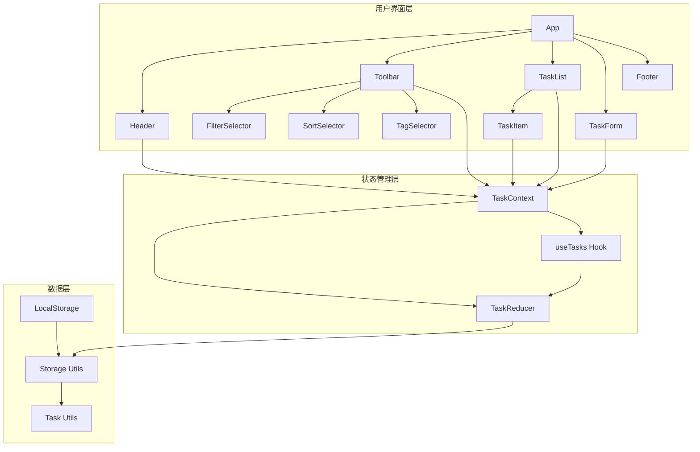
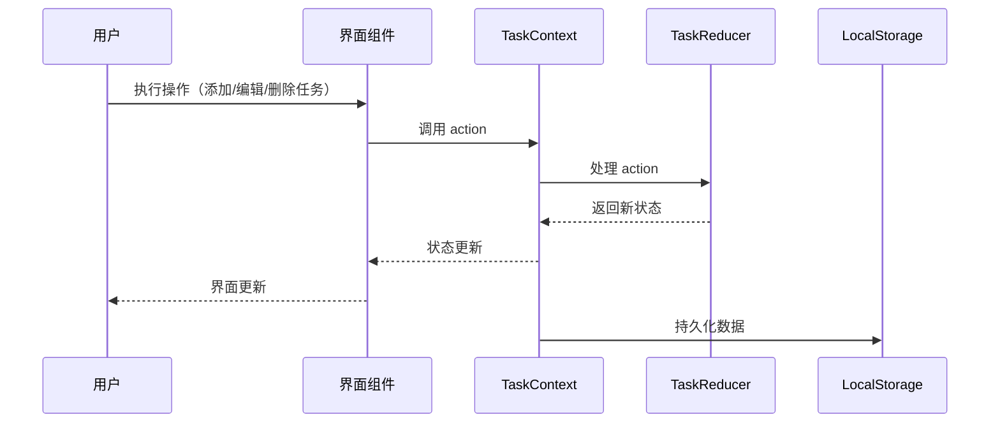

# Todo-List v0.2 技术架构设计方案

## 文档信息

| 项目     | 内容       |
| -------- | ---------- |
| 产品名称 | Todo-List  |
| 文档版本 | v0.2       |
| 创建日期 | 2026-03-08 |
| 文档状态 | 待确认     |

---

## 一、技术架构概述

### 1.1 架构设计原则

- **模块化设计**：将功能分解为独立的模块，便于维护和扩展
- **数据驱动**：采用单向数据流，确保状态管理的一致性
- **响应式设计**：适配不同屏幕尺寸，提供良好的移动端体验
- **性能优化**：采用 memoization、虚拟滚动等技术，确保应用流畅运行
- **可访问性**：符合 WCAG 标准，确保所有用户都能使用

### 1.2 技术栈选择

| 类别       | 技术/库                        | 版本    | 选型理由                               |
| ---------- | ------------------------------ | ------- | -------------------------------------- |
| 前端框架   | React                          | 18+     | 生态丰富、社区活跃、性能优异           |
| 类型系统   | TypeScript                     | 5+      | 类型安全、代码提示、减少错误           |
| 状态管理   | React Context API + useReducer | -       | 轻量级、无需额外依赖、适合中小型应用   |
| 样式方案   | 原生 CSS + CSS 变量            | -       | 灵活性高、性能好、易于维护             |
| 数据持久化 | LocalStorage                   | -       | 简单易用、浏览器原生支持、适合小数据量 |
| 第三方库   | uuid                           | ^9.0.0  | 生成唯一任务 ID                        |
| 第三方库   | react-beautiful-dnd            | ^13.1.1 | 实现拖拽排序功能                       |
| 第三方库   | date-fns                       | ^2.30.0 | 处理日期和时间                         |

### 1.3 系统架构图



---

## 二、数据模型设计

### 2.1 核心数据模型

#### Task 接口

```typescript
interface Task {
  id: string; // 任务唯一标识（UUID）
  title: string; // 任务标题
  description: string; // 任务描述和备注
  completed: boolean; // 完成状态
  priority: "high" | "medium" | "low"; // 优先级
  dueDate: number | null; // 截止日期时间戳（毫秒）
  tags: string[]; // 标签列表
  order: number; // 排序顺序
  createdAt: number; // 创建时间戳（毫秒）
  updatedAt: number; // 更新时间戳（毫秒）
}
```

#### AppState 接口

```typescript
interface AppState {
  tasks: Task[]; // 任务列表
  filter: "all" | "completed" | "active"; // 当前筛选
  sortBy: "createdAt" | "completed" | "priority" | "dueDate" | "order"; // 排序方式
  searchTerm: string; // 搜索关键词
  selectedTag: string | null; // 选中的标签
}
```

#### StorageData 接口

```typescript
interface StorageData {
  tasks: Task[];
  version: string; // 数据版本号
  lastModified: number; // 最后修改时间
}
```

#### TaskAction 类型

```typescript
type TaskAction =
  | { type: "ADD_TASK"; payload: Task }
  | { type: "UPDATE_TASK"; payload: { id: string; updates: Partial<Task> } }
  | { type: "DELETE_TASK"; payload: string }
  | { type: "TOGGLE_TASK"; payload: string }
  | { type: "SET_FILTER"; payload: "all" | "completed" | "active" }
  | {
      type: "SET_SORT_BY";
      payload: "createdAt" | "completed" | "priority" | "dueDate" | "order";
    }
  | { type: "SET_SEARCH_TERM"; payload: string }
  | { type: "SET_SELECTED_TAG"; payload: string | null }
  | {
      type: "REORDER_TASKS";
      payload: { sourceIndex: number; destinationIndex: number };
    };
```

### 2.2 数据流程



---

## 三、组件设计

### 3.1 组件层次结构

```
App
├── Header
│   └── SearchBar
├── Toolbar
│   ├── FilterSelector
│   ├── SortSelector
│   └── TagSelector
├── TaskList
│   ├── EmptyState
│   └── TaskItem
│       ├── PriorityIndicator
│       ├── TagList
│       └── TaskActions
├── TaskForm
│   ├── TitleInput
│   ├── DescriptionInput
│   ├── PrioritySelector
│   ├── DatePicker
│   └── TagInput
└── Footer
    └── AddTaskButton
```

### 3.2 核心组件设计

#### TaskItem 组件

| 属性     | 类型                                            | 描述                 |
| -------- | ----------------------------------------------- | -------------------- |
| task     | Task                                            | 任务对象             |
| onToggle | (id: string) => void                            | 切换完成状态回调     |
| onEdit   | (task: Task) => void                            | 编辑任务回调         |
| onDelete | (id: string) => void                            | 删除任务回调         |
| index    | number                                          | 任务索引（用于拖拽） |
| moveTask | (dragIndex: number, hoverIndex: number) => void | 移动任务回调         |

#### TaskForm 组件

| 属性     | 类型                 | 描述                          |
| -------- | -------------------- | ----------------------------- |
| task     | Task null            | 编辑的任务对象，null 表示新建 |
| onSave   | (task: Task) => void | 保存任务回调                  |
| onCancel | () => void           | 取消回调                      |
| isOpen   | boolean              | 是否显示表单                  |

#### Toolbar 组件

| 属性           | 类型                                         | 描述           |
| -------------- | -------------------------------------------- | -------------- |
| filter         | 'all' 'completed' 'active'                   | 当前筛选状态   |
| sortBy         | string                                       | 当前排序方式   |
| selectedTag    | string null                                  | 当前选中的标签 |
| tags           | string[]                                     | 所有可用标签   |
| onFilterChange | (filter: 'all' 'completed' 'active') => void | 筛选变更回调   |
| onSortChange   | (sortBy: string) => void                     | 排序变更回调   |
| onTagChange    | (tag: string null) => void                   | 标签变更回调   |

---

## 四、状态管理设计

### 4.1 状态管理架构

采用 React Context API + useReducer 实现状态管理，具体包括：

1. **TaskContext**：提供全局状态和操作方法
2. **TaskReducer**：处理状态更新逻辑
3. **useTasks Hook**：封装状态管理逻辑，提供便捷的操作方法

### 4.2 核心状态操作

| 操作           | 描述                   | 实现方法                                                      |
| -------------- | ---------------------- | ------------------------------------------------------------- |
| 添加任务       | 创建新任务并添加到列表 | `addTask(task: Task)`                                         |
| 编辑任务       | 更新任务属性           | `updateTask(id: string, updates: Partial<Task>)`              |
| 删除任务       | 从列表中移除任务       | `deleteTask(id: string)`                                      |
| 切换完成状态   | 切换任务的完成状态     | `toggleTask(id: string)`                                      |
| 设置筛选       | 更新筛选条件           | `setFilter(filter: 'all'  'completed'  'active')`             |
| 设置排序       | 更新排序方式           | `setSortBy(sortBy: string)`                                   |
| 设置搜索关键词 | 更新搜索关键词         | `setSearchTerm(term: string)`                                 |
| 设置选中标签   | 更新标签筛选           | `setSelectedTag(tag: string  null)`                           |
| 重新排序任务   | 通过拖拽调整任务顺序   | `reorderTasks(sourceIndex: number, destinationIndex: number)` |

### 4.3 状态持久化

- 使用 LocalStorage 存储任务数据
- 每次状态变更后自动持久化
- 应用启动时从 LocalStorage 加载数据
- 实现数据版本管理，支持数据迁移

---

## 五、实现方案

### 5.1 文件结构

```
todo-solo/
├── src/
│   ├── components/
│   │   ├── TaskList.tsx      # 任务列表组件
│   │   ├── TaskItem.tsx      # 任务项组件
│   │   ├── TaskForm.tsx      # 任务表单组件
│   │   ├── Toolbar.tsx       # 工具栏组件
│   │   ├── SearchBar.tsx     # 搜索栏组件
│   │   ├── TagSelector.tsx   # 标签选择器组件
│   │   ├── DatePicker.tsx    # 日期选择器组件
│   │   ├── PrioritySelector.tsx # 优先级选择器组件
│   │   ├── EmptyState.tsx    # 空状态组件
│   │   ├── Header.tsx        # 头部组件
│   │   └── Footer.tsx        # 底部组件
│   ├── hooks/
│   │   ├── useTasks.ts       # 任务管理Hook
│   │   └── useLocalStorage.ts # 本地存储Hook
│   ├── types/
│   │   └── index.ts          # 类型定义文件
│   ├── utils/
│   │   ├── storage.ts        # 存储工具
│   │   ├── helpers.ts        # 辅助函数
│   │   └── dateUtils.ts      # 日期处理工具
│   ├── styles/
│   │   ├── global.css        # 全局样式
│   │   ├── design-tokens.css # 设计令牌
│   │   └── components.css    # 组件样式
│   ├── context/
│   │   └── TaskContext.tsx   # 任务上下文
│   ├── App.tsx               # 应用根组件
│   └── main.tsx              # 应用入口
├── public/                   # 静态资源
├── package.json              # 项目配置
├── tsconfig.json             # TypeScript配置
├── vite.config.ts            # Vite配置
└── README.md                 # 项目说明
```

### 5.2 核心文件修改

#### 1. src/types/index.ts

扩展 Task、AppState 和 TaskAction 类型，添加新的字段和操作类型。

#### 2. src/context/TaskContext.tsx

更新 TaskContext 和 TaskReducer，处理新的状态和操作。

#### 3. src/hooks/useTasks.ts

扩展 useTasks Hook，添加新的操作方法。

#### 4. src/utils/storage.ts

更新存储工具，支持新的数据结构。

#### 5. src/components/TaskItem.tsx

更新任务项组件，显示优先级、截止日期、标签等信息。

#### 6. src/components/TaskForm.tsx

更新任务表单组件，添加优先级、截止日期、标签等输入字段。

#### 7. src/components/Toolbar.tsx

更新工具栏组件，添加标签筛选功能。

#### 8. src/styles/components.css

更新组件样式，适配新的 UI 设计。

### 5.3 新增文件

#### 1. src/components/TagSelector.tsx

实现标签选择器组件。

#### 2. src/components/DatePicker.tsx

实现日期选择器组件。

#### 3. src/components/PrioritySelector.tsx

实现优先级选择器组件。

#### 4. src/utils/dateUtils.ts

添加日期处理工具函数。

---

## 六、性能优化策略

### 6.1 渲染优化

- 使用 React.memo 缓存组件渲染
- 使用 useCallback 缓存回调函数
- 使用 useMemo 缓存计算结果
- 实现虚拟滚动，处理大量任务

### 6.2 状态管理优化

- 合理设计状态结构，避免不必要的状态更新
- 使用 batch updates 减少渲染次数
- 实现状态分片，只更新相关组件

### 6.3 存储优化

- 批量写入 LocalStorage，减少 I/O 操作
- 实现防抖机制，避免频繁存储
- 压缩存储数据，减少存储空间

### 6.4 拖拽性能优化

- 使用 react-beautiful-dnd 的性能优化选项
- 实现拖拽过程中的视觉反馈
- 避免拖拽过程中的不必要计算

---

## 七、移动端适配方案

### 7.1 响应式设计

- 使用媒体查询适配不同屏幕尺寸
- 采用弹性布局，适应不同设备
- 优化触摸目标大小，确保移动端操作体验

### 7.2 移动端交互优化

- 支持左右滑动任务卡片显示操作按钮
- 长按任务卡片进入拖拽模式
- 下拉刷新任务列表
- 优化表单输入体验，支持移动键盘

### 7.3 性能适配

- 减少移动端不必要的动画效果
- 优化图片和资源加载
- 实现离线缓存，支持离线使用

---

## 八、测试策略

### 8.1 单元测试

- 测试核心工具函数
- 测试状态管理逻辑
- 测试组件渲染

### 8.2 集成测试

- 测试组件间交互
- 测试完整的用户流程
- 测试数据持久化

### 8.3 端到端测试

- 测试完整的应用功能
- 测试不同浏览器兼容性
- 测试移动端适配

---

## 九、部署方案

### 9.1 构建优化

- 使用 Vite 进行快速构建
- 配置生产环境优化选项
- 实现代码分割，减少初始加载时间

### 9.2 部署平台

- 支持部署到 Vercel、Netlify 等静态网站托管平台
- 支持部署到 GitHub Pages
- 支持容器化部署

---

## 十、风险评估与应对

### 10.1 风险识别

| 风险项           | 风险等级 | 可能性 | 影响程度 |
| ---------------- | -------- | ------ | -------- |
| 数据结构变更     | 中       | 高     | 高       |
| 拖拽性能问题     | 低       | 中     | 中       |
| 移动端适配问题   | 中       | 中     | 中       |
| 浏览器兼容性问题 | 低       | 低     | 中       |

### 10.2 应对措施

#### 数据结构变更

- 实现数据迁移机制，确保旧数据兼容
- 提供数据备份和恢复功能
- 详细的错误处理和日志记录

#### 拖拽性能问题

- 优化拖拽算法，减少计算量
- 实现拖拽过程中的节流处理
- 为低性能设备提供降级方案

#### 移动端适配问题

- 多设备测试，确保适配效果
- 使用现代 CSS 特性，提高适配能力
- 为不同设备提供针对性优化

#### 浏览器兼容性问题

- 使用 Babel 进行代码转换
- 提供 Polyfill 支持
- 定期测试主流浏览器

---

## 十一、开发计划

### 11.1 阶段一：核心功能开发（2 周）

**目标**：实现 v0.2 版本的核心功能

**任务清单**：

- 扩展数据模型和类型定义
- 实现任务分类/标签功能
- 实现任务优先级功能
- 实现截止日期和提醒功能
- 实现任务描述和备注功能
- 实现拖拽排序功能

**交付物**：

- 完整的核心功能实现
- 基础 UI 样式

### 11.2 阶段二：移动端适配（1 周）

**目标**：优化移动端体验

**任务清单**：

- 实现响应式布局
- 优化触摸操作
- 测试不同屏幕尺寸的适配效果

**交付物**：

- 移动端友好的界面
- 良好的触摸操作体验

### 11.3 阶段三：测试与优化（3-5 天）

**目标**：确保产品质量和性能

**任务清单**：

- 功能测试和 Bug 修复
- 性能测试和优化
- 浏览器兼容性测试
- 用户体验测试和优化

**交付物**：

- 稳定可用的产品
- 完整的测试报告

---

## 十二、总结

Todo-List v0.2 版本的技术架构设计基于 React + TypeScript，采用模块化、数据驱动的设计理念，实现了任务分类/标签、优先级、截止日期、拖拽排序等核心功能，并优化了移动端体验。

通过合理的状态管理、性能优化和测试策略，确保应用的稳定性和可靠性。同时，预留了扩展空间，为未来的功能迭代做好准备。

本设计方案充分考虑了用户体验、性能要求和开发效率，为 Todo-List v0.2 版本的实现提供了清晰的技术指导。
