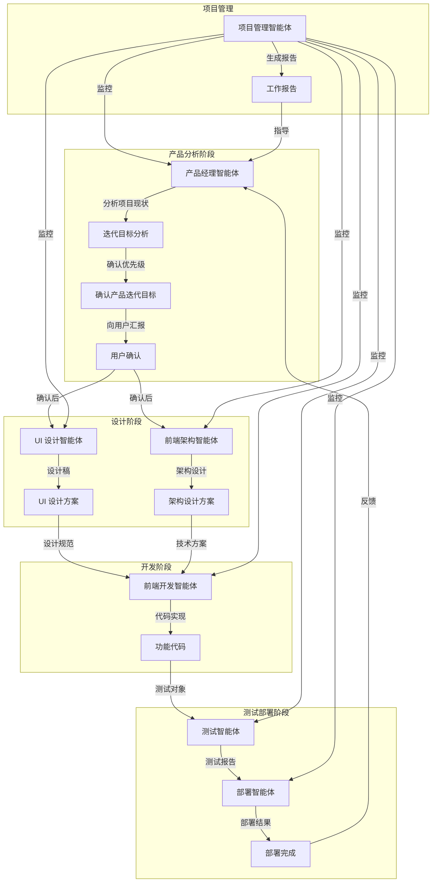

# Todo-List 项目多智能体协同工作流设计

## 1. 项目分析

### 1.1 现有项目结构

Todo-List 项目是一个基于 React + TypeScript + Vite 的 MVP 应用，主要功能包括：

- **核心功能**：创建、编辑、删除、标记完成任务，任务列表展示，数据持久化
- **基础功能**：任务搜索、筛选、排序，批量操作
- **增强功能**：任务详情、撤销操作、快捷键支持、导入导出

项目已有的文档包括：
- PRD.md（产品需求文档）
- frontend-architecture.md（前端架构设计）
- UI-Design.md（UI 设计文档）

### 1.2 技术栈

- 框架：React 18.x
- 语言：TypeScript 5.x
- 构建工具：Vite 5.x
- 状态管理：React Context API + useReducer
- 数据持久化：localStorage
- UI 工具：原生 CSS + CSS 变量
- 工具库：uuid
- 测试工具：Vitest

## 2. 智能体类型与职责划分

### 2.1 智能体类型

| 智能体名称 | 职责范围 | 输入 | 输出 |
|----------|---------|------|------|
| 产品经理智能体 | 产品分析、需求收集、功能规划、用户故事编写 | 项目现状、用户反馈、市场趋势 | 产品需求文档、迭代目标、功能优先级 |
| UI 设计智能体 | 界面设计、交互设计、视觉风格、响应式设计 | 产品需求、设计系统规范 | UI 设计稿、交互原型、设计规范 |
| 前端架构智能体 | 技术选型、架构设计、性能优化、代码规范 | 产品需求、技术趋势 | 架构设计文档、技术选型方案、性能优化策略 |
| 前端开发智能体 | 代码实现、功能开发、单元测试、代码审查 | 架构设计、UI 设计 | 功能代码、测试用例、代码审查报告 |
| 测试智能体 | 测试计划、功能测试、性能测试、兼容性测试 | 产品需求、功能代码 | 测试报告、Bug 列表、测试用例 |
| 部署智能体 | 构建部署、环境配置、CI/CD 配置、监控设置 | 功能代码、测试报告 | 部署配置、构建产物、监控报告 |
| 项目管理智能体 | 进度跟踪、资源分配、风险评估、报告生成 | 各智能体工作状态、项目数据 | 项目进度报告、风险评估报告、工作总结 |

## 3. 智能体工作流程图

## 4. 完整的迭代循环工作流

### 4.1 工作流步骤

1. **产品分析**
   - 产品经理智能体分析项目现状、用户反馈和市场趋势
   - 识别当前版本的问题和改进空间
   - 收集新功能需求和优化建议

2. **迭代目标分析**
   - 产品经理智能体基于分析结果，确定迭代目标
   - 评估需求优先级和可行性
   - 制定迭代计划和时间表

3. **确认产品迭代目标**
   - 产品经理智能体生成详细的产品需求文档
   - 明确功能范围、用户故事和验收标准
   - 向用户汇报迭代内容和计划
   - **用户确认**：用户确认迭代内容后，继续执行工作流

4. **UI 设计**
   - UI 设计智能体根据产品需求，设计界面和交互
   - 遵循设计系统规范，确保视觉一致性
   - 生成 UI 设计稿和交互原型

5. **架构设计**
   - 前端架构智能体根据产品需求，设计技术架构
   - 选择合适的技术栈和实现方案
   - 制定性能优化策略和代码规范

6. **程序开发**
   - 前端开发智能体根据 UI 设计和架构设计，实现功能代码
   - 编写单元测试和集成测试
   - 进行代码审查和优化

7. **测试部署**
   - 测试智能体执行功能测试、性能测试和兼容性测试
   - 生成测试报告和 Bug 列表
   - 部署智能体构建和部署应用
   - 配置监控和告警机制

8. **循环回到产品分析**
   - 收集用户反馈和使用数据
   - 分析部署后的效果和问题
   - 开始下一轮迭代

### 4.2 智能体协作机制

- **信息传递**：智能体之间通过标准化的文档和接口进行信息传递
- **依赖关系**：每个步骤都依赖前一个步骤的输出作为输入
- **质量控制**：每个智能体都要对自己的输出质量负责
- **反馈机制**：后一个步骤的智能体要向前一个步骤的智能体提供反馈
- **异常处理**：当出现问题时，相关智能体要协同解决

### 4.3 工作流自动化

- **触发机制**：工作流可以通过定时触发、事件触发或手动触发
- **状态管理**：使用状态机管理整个工作流的状态
- **版本控制**：所有文档和代码都要进行版本控制
- **审计跟踪**：记录每个步骤的执行情况和责任人

## 5. 定时总结工作报告机制

### 5.1 报告级别

- **每日报告**：总结当天的工作进展和问题
- **每周报告**：总结一周的工作成果和计划
- **每月报告**：总结一个月的工作业绩和趋势

### 5.2 报告内容

**每日报告**：
- 当天完成的任务
- 遇到的问题和解决方案
- 明天的工作计划
- 资源需求

**每周报告**：
- 本周完成的功能和修复的 Bug
- 本周遇到的主要问题和解决情况
- 下周的工作计划和优先级
- 项目进度与计划的偏差

**每月报告**：
- 本月完成的迭代目标
- 项目整体进度和质量状况
- 遇到的重大挑战和应对措施
- 下月的迭代计划和目标
- 资源使用情况和优化建议

### 5.3 报告生成流程

1. **数据收集**：项目管理智能体收集各智能体的工作数据
2. **数据分析**：分析工作数据，识别趋势和问题
3. **报告生成**：根据数据生成标准化的报告
4. **报告分发**：将报告分发给相关人员和智能体
5. **报告评审**：团队评审报告，提出改进建议

### 5.4 报告格式

- **文档格式**：Markdown 或 PDF
- **图表可视化**：使用图表展示进度和趋势
- **数据表格**：使用表格展示详细数据
- **摘要**：每个报告都要有简明的摘要

## 6. 工作流实施建议

### 6.1 智能体配置

- **硬件配置**：为每个智能体分配足够的计算资源
- **软件环境**：确保智能体运行所需的软件环境
- **网络连接**：保证智能体之间的网络通信稳定
- **安全措施**：实施必要的安全措施，保护代码和数据

### 6.2 工作流监控

- **进度监控**：实时监控工作流的执行进度
- **质量监控**：监控每个步骤的输出质量
- **异常监控**：及时发现和处理异常情况
- **性能监控**：监控智能体的性能和资源使用情况

### 6.3 工作流优化

- **流程优化**：不断优化工作流程，提高效率
- **智能体优化**：根据实际情况调整智能体的职责和配置
- **工具优化**：使用合适的工具和技术，提高智能体的能力
- **反馈优化**：建立有效的反馈机制，持续改进

### 6.4 风险控制

- **风险识别**：识别工作流中可能出现的风险
- **风险评估**：评估风险的影响和可能性
- **风险应对**：制定风险应对策略和预案
- **风险监控**：监控风险的发展和变化

## 7. 总结

本工作流设计通过多个智能体的协同工作，实现了 Todo-List 项目的自动迭代。通过明确的职责划分、标准化的工作流程和有效的监控机制，确保了项目的质量和进度。同时，通过定时总结工作报告，及时发现和解决问题，持续优化项目。

这种多智能体协同工作的方式，不仅提高了开发效率，还保证了产品质量，为 Todo-List 项目的持续发展提供了有力的支持。