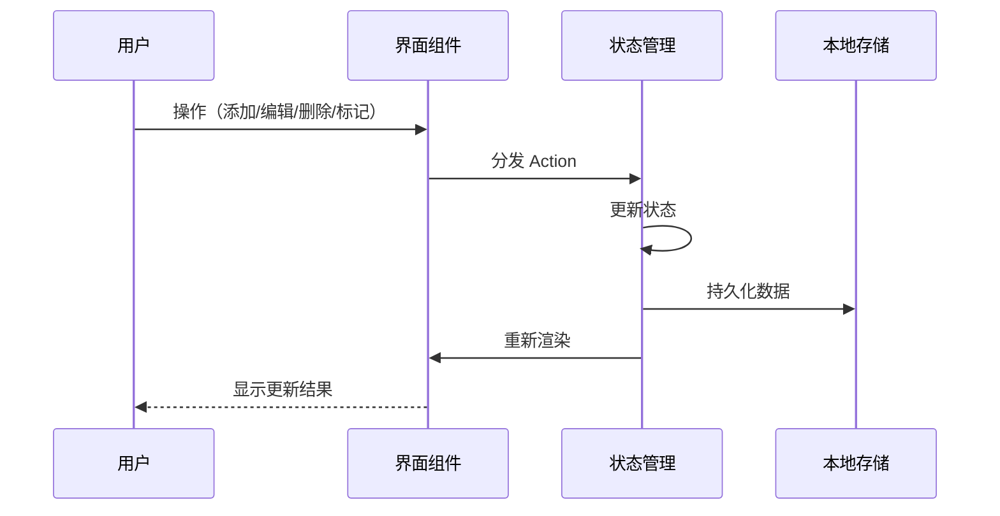
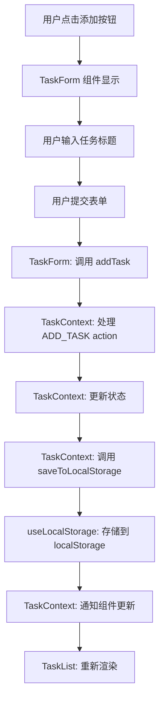
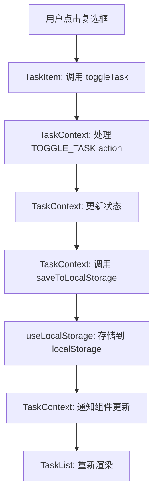
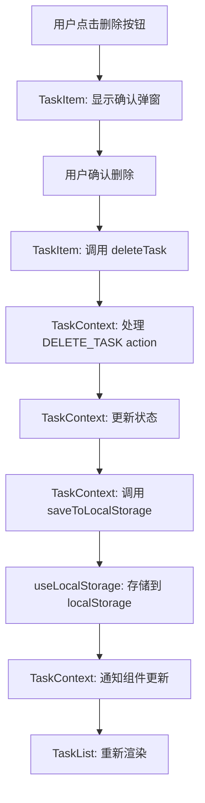
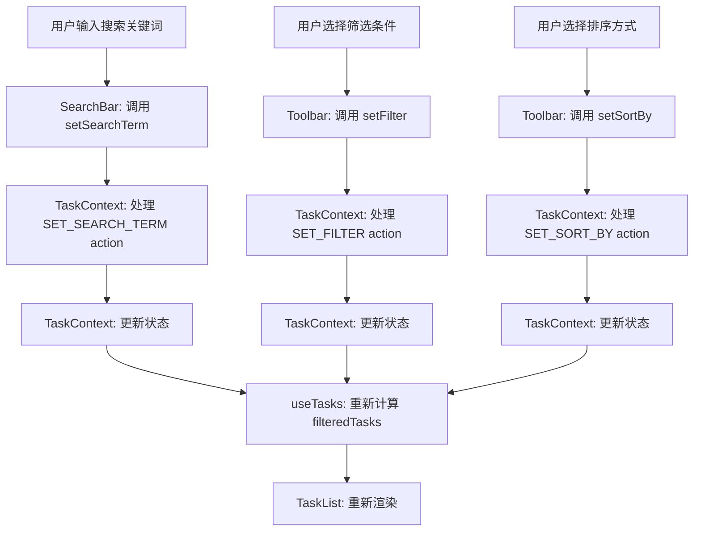

# Todo-List MVP 前端架构设计方案

## 1. 仓库分析

通过对项目仓库的分析，我们了解到以下关键信息：

### 1.1 项目需求（基于 PRD.md）

- **核心功能**：创建、编辑、删除、标记完成任务，任务列表展示，数据持久化
- **基础功能**：任务搜索、筛选、排序，批量操作
- **增强功能**：任务详情、撤销操作、快捷键支持、导入导出
- **技术架构**：现代 Web 技术（React/Vue 等前端框架）
- **数据结构**：明确的 Task 接口设计，包含 id、title、completed、createdAt、updatedAt 字段
- **用户流程**：清晰的任务管理流程，包括创建、编辑、删除、标记完成等操作

### 1.2 UI 设计（基于 UI-Design.md）

- **设计系统**：完整的色彩、字体、间距、圆角、阴影系统
- **组件设计**：详细的组件规格和交互状态
- **响应式设计**：移动端、平板端、桌面端适配
- **交互设计**：动画效果和微交互
- **可访问性设计**：对比度、键盘导航、焦点状态

### 1.3 样式规范（基于 design-tokens.css 和 components.css）

- **CSS 变量**：完整的设计令牌系统
- **组件样式**：详细的组件实现样式
- **响应式布局**：媒体查询断点
- **动画效果**：过渡和关键帧动画
- **可访问性**：焦点状态和屏幕阅读器支持

## 2. 前端架构设计

### 2.1. 技术栈选择

| 分类 | 技术 | 版本 | 选型理由 |
| :--- | :--- | :--- | :--- |
| 框架 | React | 18.x | 生态丰富、社区活跃、类型安全，适合快速开发和迭代。 |
| 语言 | TypeScript | 5.x | 提供类型安全，减少运行时错误，提升开发体验。 |
| 构建工具 | Vite | 5.x | 快速的开发服务器和构建速度，支持热模块替换。 |
| 状态管理 | React Context API + useReducer | - | 轻量级状态管理方案，无需额外依赖，适合中小型应用。 |
| 数据持久化 | localStorage | - | 简单易用，浏览器原生支持，适合小数据量存储。 |
| UI 工具 | 原生 CSS + CSS 变量 | - | 基于设计系统的 CSS 变量，保持样式一致性和可维护性。 |
| 工具库 | uuid | 9.x | 生成唯一任务 ID。 |
| 测试工具 | Vitest | 1.x | 快速的单元测试框架，与 Vite 集成良好。 |

### 2.2. 关键设计

#### 2.2.1. 架构风格

- **架构风格**：组件化单页应用 (SPA)
- **模块划分**：
  - `components/`：UI 组件
  - `hooks/`：自定义 Hooks
  - `types/`：TypeScript 类型定义
  - `utils/`：工具函数
  - `styles/`：样式文件

- **核心流程图**：



#### 2.2.2. 目录结构

```plaintext
todo-solo/
├── public/              # 静态资源
│   └── favicon.ico
├── src/                 # 源代码
│   ├── components/      # 组件
│   │   ├── Header.tsx       # 顶部导航栏
│   │   ├── SearchBar.tsx    # 搜索栏
│   │   ├── Toolbar.tsx      # 工具栏（筛选、排序）
│   │   ├── TaskList.tsx     # 任务列表
│   │   ├── TaskItem.tsx     # 任务项
│   │   ├── TaskForm.tsx     # 任务表单
│   │   ├── Footer.tsx       # 底部操作栏
│   │   ├── Modal.tsx        # 确认弹窗
│   │   └── EmptyState.tsx   # 空状态
│   ├── hooks/           # 自定义 Hooks
│   │   ├── useTasks.ts      # 任务管理 Hook
│   │   └── useLocalStorage.ts # 本地存储 Hook
│   ├── types/           # 类型定义
│   │   └── index.ts         # 类型定义文件
│   ├── utils/           # 工具函数
│   │   ├── storage.ts       # 存储工具
│   │   └── helpers.ts       # 辅助函数
│   ├── styles/          # 样式文件
│   │   ├── global.css       # 全局样式
│   │   ├── design-tokens.css # 设计令牌
│   │   └── components.css   # 组件样式
│   ├── context/         # 状态管理
│   │   └── TaskContext.tsx  # 任务上下文
│   ├── App.tsx          # 应用根组件
│   └── main.tsx         # 应用入口
├── package.json         # 项目配置
├── tsconfig.json        # TypeScript 配置
├── vite.config.ts       # Vite 配置
└── README.md            # 项目说明
```

* 说明：
  * `components/`（新增）：存放所有 UI 组件，按功能模块划分。
  * `hooks/`（新增）：存放自定义 Hooks，用于逻辑复用。
  * `types/`（新增）：存放 TypeScript 类型定义。
  * `utils/`（新增）：存放工具函数，如存储操作和辅助函数。
  * `styles/`（新增）：存放样式文件，包括全局样式和设计令牌。
  * `context/`（新增）：存放 React Context，用于状态管理。

#### 2.2.3. 关键类与函数设计

| 类/函数名 | 说明 | 参数（类型/含义） | 成功返回结构/类型 | 失败返回结构/类型 | 所属文件/模块 | 溯源 |
|----------|------|-----------------|-----------------|-----------------|-------------|------|
| `TaskContext` | 任务状态管理上下文 | - | - | - | src/context/TaskContext.tsx | PRD.md: 5.2 应用状态模型 |
| `useTasks` | 任务管理 Hook | - | `{ tasks, filteredTasks, addTask, updateTask, deleteTask, toggleTask, setFilter, setSortBy, setSearchTerm }` | - | src/hooks/useTasks.ts | PRD.md: 2.1-2.2 功能清单 |
| `useLocalStorage` | 本地存储 Hook | `key: string, initialValue: T` | `[storedValue, setValue]` | - | src/hooks/useLocalStorage.ts | PRD.md: 2.1 F-006 数据持久化 |
| `addTask` | 添加任务 | `title: string` | `Task` 对象 | - | src/context/TaskContext.tsx | PRD.md: 2.1 F-001 创建任务 |
| `updateTask` | 更新任务 | `id: string, updates: Partial<Task>` | `Task` 对象 | - | src/context/TaskContext.tsx | PRD.md: 2.1 F-002 编辑任务 |
| `deleteTask` | 删除任务 | `id: string` | `void` | - | src/context/TaskContext.tsx | PRD.md: 2.1 F-003 删除任务 |
| `toggleTask` | 切换任务完成状态 | `id: string` | `Task` 对象 | - | src/context/TaskContext.tsx | PRD.md: 2.1 F-004 标记完成 |
| `filterTasks` | 筛选任务 | `tasks: Task[], filter: string, searchTerm: string` | `Task[]` | - | src/utils/helpers.ts | PRD.md: 2.2 F-007 任务搜索, F-008 任务筛选 |
| `sortTasks` | 排序任务 | `tasks: Task[], sortBy: string` | `Task[]` | - | src/utils/helpers.ts | PRD.md: 2.2 F-009 任务排序 |

**Task 类型定义**：

| 字段名 | 类型 | 说明 | 所属文件/模块 | 溯源 |
|-------|------|------|-------------|------|
| `id` | `string` | 任务唯一标识（UUID） | src/types/index.ts | PRD.md: 5.1 任务数据模型 |
| `title` | `string` | 任务标题 | src/types/index.ts | PRD.md: 5.1 任务数据模型 |
| `completed` | `boolean` | 完成状态 | src/types/index.ts | PRD.md: 5.1 任务数据模型 |
| `createdAt` | `number` | 创建时间戳（毫秒） | src/types/index.ts | PRD.md: 5.1 任务数据模型 |
| `updatedAt` | `number` | 更新时间戳（毫秒） | src/types/index.ts | PRD.md: 5.1 任务数据模型 |

**AppState 类型定义**：

| 字段名 | 类型 | 说明 | 所属文件/模块 | 溯源 |
|-------|------|------|-------------|------|
| `tasks` | `Task[]` | 任务列表 | src/types/index.ts | PRD.md: 5.2 应用状态模型 |
| `filter` | `"all" \| "completed" \| "active"` | 当前筛选 | src/types/index.ts | PRD.md: 5.2 应用状态模型 |
| `sortBy` | `"createdAt" \| "completed"` | 排序方式 | src/types/index.ts | PRD.md: 5.2 应用状态模型 |
| `searchTerm` | `string` | 搜索关键词 | src/types/index.ts | PRD.md: 5.2 应用状态模型 |

#### 2.2.4. 数据库与数据结构设计

**数据存储结构**：

| 配置项 | 类型 | 默认值 | 说明 | 所属文件/模块 | 类型 | 溯源 |
|-------|------|-------|------|-------------|------|------|
| `tasks` | `Task[]` | `[]` | 任务列表 | localStorage | 新增 | PRD.md: 5.3 数据存储结构 |
| `version` | `string` | `"1.0"` | 数据版本号 | localStorage | 新增 | PRD.md: 5.3 数据存储结构 |
| `lastModified` | `number` | `Date.now()` | 最后修改时间 | localStorage | 新增 | PRD.md: 5.3 数据存储结构 |

**存储键名**：`todo-list-mvp-storage`

#### 2.2.4. API 接口设计

本项目为纯前端应用，无后端 API 接口。所有数据操作通过本地存储完成。

#### 2.2.5. 主业务流程与调用链

**创建任务流程**：



**调用链**：
- `TaskForm.tsx:handleSubmit` → `TaskContext:addTask` → `TaskContext:saveToLocalStorage` → `useLocalStorage:setValue`

**标记完成流程**：



**调用链**：
- `TaskItem.tsx:handleToggle` → `TaskContext:toggleTask` → `TaskContext:saveToLocalStorage` → `useLocalStorage:setValue`

**删除任务流程**：



**调用链**：
- `TaskItem.tsx:handleDelete` → `TaskContext:deleteTask` → `TaskContext:saveToLocalStorage` → `useLocalStorage:setValue`

**搜索筛选流程**：



**调用链**：
- `SearchBar.tsx:handleSearch` → `TaskContext:setSearchTerm` → `useTasks:filteredTasks` → `TaskList:render`
- `Toolbar.tsx:handleFilterChange` → `TaskContext:setFilter` → `useTasks:filteredTasks` → `TaskList:render`
- `Toolbar.tsx:handleSortChange` → `TaskContext:setSortBy` → `useTasks:filteredTasks` → `TaskList:render`

## 3. 部署与集成方案

### 3.1. 依赖与环境

| 依赖 | 版本/范围 | 用途 | 安装命令 | 所属文件/配置 |
|-----|----------|------|---------|-------------|
| `react` | `^18.2.0` | 核心框架 | `npm install react` | package.json |
| `react-dom` | `^18.2.0` | DOM 渲染 | `npm install react-dom` | package.json |
| `typescript` | `^5.2.2` | 类型系统 | `npm install -D typescript` | package.json |
| `vite` | `^5.0.0` | 构建工具 | `npm install -D vite` | package.json |
| `@vitejs/plugin-react` | `^4.2.1` | React 插件 | `npm install -D @vitejs/plugin-react` | package.json |
| `uuid` | `^9.0.1` | 生成唯一 ID | `npm install uuid` | package.json |
| `@types/uuid` | `^9.0.7` | UUID 类型定义 | `npm install -D @types/uuid` | package.json |
| `vitest` | `^1.0.0` | 测试框架 | `npm install -D vitest` | package.json |

### 3.3. 集成与启动方案

- **开发环境启动**：
  ```bash
  npm run dev
  ```

- **生产环境构建**：
  ```bash
  npm run build
  ```

- **预览生产构建**：
  ```bash
  npm run preview
  ```

- **运行测试**：
  ```bash
  npm run test
  ```

## 4. 代码安全性

### 4.1. 注意事项

1. **LocalStorage 安全**：LocalStorage 存储在浏览器中，可能被恶意脚本访问，不适合存储敏感信息。
2. **输入验证**：用户输入的任务标题需要进行验证，防止 XSS 攻击。
3. **数据大小限制**：LocalStorage 有 5MB 的存储限制，需要处理数据量过大的情况。
4. **错误处理**：需要处理 LocalStorage 存储失败的情况。
5. **并发操作**：多个标签页同时操作可能导致数据不一致。

### 4.2. 解决方案

1. **LocalStorage 安全**：
   - 只存储非敏感数据（任务标题、状态等）
   - 对输入进行转义处理，防止 XSS 攻击

2. **输入验证**：
   - 在 `TaskForm` 组件中添加输入验证
   - 限制任务标题长度，防止过长输入

3. **数据大小限制**：
   - 实现数据清理机制，提示用户清理旧任务
   - 监控 LocalStorage 使用量，当接近限制时给出警告

4. **错误处理**：
   - 在 `useLocalStorage` Hook 中添加错误捕获
   - 当存储失败时，提供用户友好的错误提示

5. **并发操作**：
   - 实现简单的乐观锁机制，基于 `lastModified` 时间戳
   - 当检测到数据冲突时，提示用户选择保留哪个版本

## 5. 性能优化策略

### 5.1. 渲染优化

1. **组件 memoization**：
   - 使用 `React.memo` 包装纯展示组件
   - 对 `TaskItem` 组件使用 `React.memo` 减少不必要的渲染

2. **状态管理优化**：
   - 使用 `useReducer` 管理复杂状态，减少重新渲染
   - 合理设计状态结构，避免不必要的状态更新

3. **虚拟列表**：
   - 当任务数量超过 100 时，使用虚拟列表技术
   - 只渲染可视区域内的任务，提高渲染性能

### 5.2. 存储优化

1. **批量存储**：
   - 实现防抖机制，避免频繁写入 LocalStorage
   - 当用户连续操作时，延迟存储操作

2. **数据压缩**：
   - 对存储的数据进行 JSON 压缩
   - 减少 LocalStorage 的使用空间

### 5.3. 加载优化

1. **代码分割**：
   - 使用动态导入，实现代码分割
   - 减少初始加载时间

2. **资源优化**：
   - 优化 CSS 文件，减少冗余样式
   - 使用现代 CSS 特性，如 CSS 变量

3. **预加载**：
   - 预加载关键资源
   - 提高首次渲染速度

## 6. 可访问性设计

### 6.1. 键盘导航

- 支持 Tab 键在可交互元素间切换
- 支持 Enter 键确认操作
- 支持 Esc 键取消操作、关闭弹窗
- 支持方向键在任务列表中导航

### 6.2. 屏幕阅读器支持

- 使用语义化 HTML 元素
- 添加适当的 ARIA 属性
- 为图标和非文本元素添加屏幕阅读器文本

### 6.3. 对比度

- 文字与背景对比度：≥ 4.5:1
- 大文字与背景对比度：≥ 3:1
- 交互元素与背景对比度：≥ 3:1

### 6.4. 焦点状态

- 为所有可交互元素添加清晰的焦点状态
- 使用 `:focus-visible` 伪类优化焦点样式
- 确保焦点顺序逻辑合理

## 7. 测试策略

### 7.1. 单元测试

- 测试组件渲染
- 测试 Hook 逻辑
- 测试工具函数

### 7.2. 集成测试

- 测试组件间交互
- 测试状态管理流程
- 测试数据持久化

### 7.3. 端到端测试

- 测试完整用户流程
- 测试响应式布局
- 测试浏览器兼容性

## 8. 开发规范

### 8.1. 代码风格

- 使用 ESLint 进行代码质量检查
- 使用 Prettier 进行代码格式化
- 遵循 Airbnb React 编码规范

### 8.2. 命名规范

- 组件名：PascalCase
- 函数名：camelCase
- 变量名：camelCase
- 常量名：UPPER_SNAKE_CASE
- 文件名：与组件名或功能一致

### 8.3. 注释规范

- 组件使用 JSDoc 注释
- 复杂逻辑添加行内注释
- 关键决策添加注释说明

### 8.4. 版本控制

- 使用 Git 进行版本控制
- 遵循语义化版本规范
- 提交信息清晰明了

## 9. 项目启动步骤

1. **初始化项目**：
   ```bash
   npm create vite@latest todo-solo -- --template react-ts
   cd todo-solo
   ```

2. **安装依赖**：
   ```bash
   npm install uuid
   npm install -D @types/uuid vitest
   ```

3. **创建目录结构**：
   ```bash
   mkdir -p src/components src/hooks src/types src/utils src/styles src/context
   ```

4. **复制样式文件**：
   ```bash
   cp design/design-tokens.css src/styles/
   cp design/components.css src/styles/
   ```

5. **实现核心功能**：
   - 创建类型定义
   - 实现状态管理
   - 开发 UI 组件
   - 实现数据持久化

6. **启动开发服务器**：
   ```bash
   npm run dev
   ```

7. **构建生产版本**：
   ```bash
   npm run build
   ```

## 10. 总结

本前端架构方案基于 React + TypeScript + Vite 技术栈，实现了一个功能完整、性能优化、可访问性良好的 Todo-List MVP 应用。方案遵循现代前端开发最佳实践，包括组件化设计、状态管理、数据持久化、性能优化和可访问性设计。

通过清晰的目录结构和模块化设计，确保了代码的可维护性和可扩展性。同时，严格遵循设计规范，确保了 UI 的一致性和美观性。

该方案满足了 PRD 中定义的所有核心功能和基础功能，并为后续的增强功能预留了扩展空间。